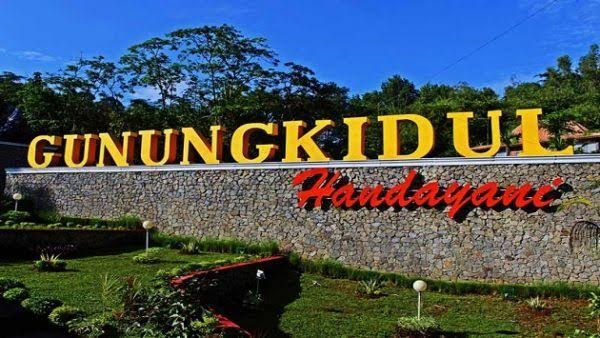

Kabupaten Gunungkidul merupakan salah satu kabupaten Di Daerah Istimewa Yogyakarta. Di kabupaten Gunungkidul memiliki 18 kapanewon dan 144 kalurahan. Gunungkidul merupakan daerah pegunungan yang pada saat musim kemaru mengalami kekeringan. Tetapi, Gunungkidul merupakan tempat yang asri dan sejuk di pagi hari. Tidak hanya itu, Gunungkidul juga memiliki tempat wisata yang tidak kalah cantiknya dengan tempat yang lain. 

Gunungkidul kaya dengan kebudayaan dan keindahan wisatanya. contohnya Gunung Api Purba , Embung nglanggeran, Pantai sepanjang, Pantai baron, Pantai krakal dan masih banyak lagi. Banyak wisatawan dari berbagai negara yang ingin mengunjungi daerah Gunungkidul. Tak salah jika Gunungkidul merupakan tempat wisata yang wajib dikunjungi pengunjung.