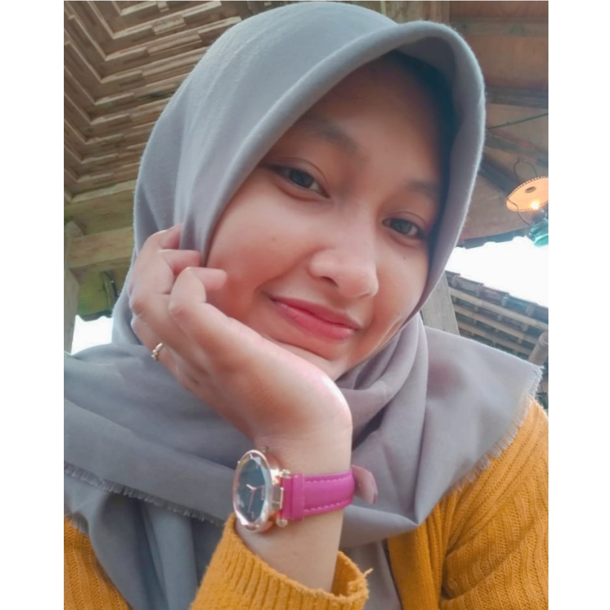

Fokus untuk masa depan adalah kunci utama seseorang belajar. Konteks belajar disini luas yaa man teman. Belajar dalam memeperbaiki kepribadian, sikap, kedewasaan, meraih cita-cita, membahagiakan orang tua, dan masih banyak lain. 

Seperti saya saat ini belajar ingin membahagiakan orang tua dan ingin mencapai cita-cita. Telah diulas di postingan sebelumnya bahwa komputer adalah jurusan yang saya ambil. Dan cita-cita yang saya inginkan adalah menjadi "Databases Administrator". 

Hal utama yang memotifasi saya adalah "Bapak" dan "Ibu". Kunci utama seseorang dalam meraih cita-cita adalah hal utama yang memotifasi diri sendiri.

.

<i>Sugeng Priyono dan Ninik Retno Wulansih